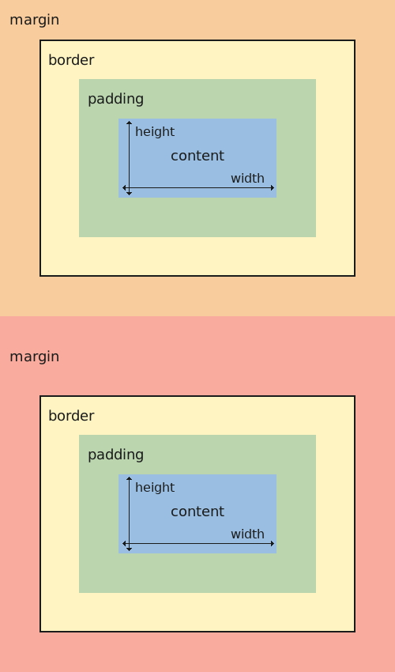

# 2026-9-1(W7D2)
## 今日主题:盒模型
## 学了什么:
### 溢出overflow
溢出二维 overflow-x overflow-y
hidden(溢出完全隐藏)
scroll(溢出滚动)
auto(让浏览器决定)
注意尽量别水平滚动
### 变换属性transform
它可以对元素进行各种变换，如旋转、缩放、倾斜或在二维或三维空间中平移（移动）。
translate:(x,y);平移
rotate(xdeg);顺时针旋转角度
scale(x,y);拉伸倍率
skew() 函数：使用该函数能让你倾斜元素
变换和可访问性：如果你使用变换隐藏或显示内容，请确保屏幕阅读器和键盘导航仍可访问内容。 隐藏内容应真正隐藏，例如使用 display: none 或 visibility: hidden，而不仅仅是在视觉上移到屏幕外。
### 盒模型
定义：在 CSS 盒模型中，每个元素都被一个盒子包围。 这个盒子由四个部分组成：内容区域、padding、border、margin。
内容区域：内容区域是盒子的最内层部分。 它是包含文本或图像等元素实际内容的空间。
padding：内边距是紧邻内容区域的部分。 它是内容区域与元素边框之间的空间。
border：边框是元素在盒模型中的最外层轮廓。 这是元素的视觉边界。
margin：外边距是元素边框之外的空间。 用于控制该元素与周围其他元素之间的距离。

### 外边距折叠
定义：这种行为发生在相邻元素的垂直外边距发生重叠时，结果是合并成一个外边距，等于两者中较大的那一个。 这种行为只适用于垂直外边距（上下），不适用于水平外边距（左右）。
### box-sizing的两个属性Content-box 和 border-box 
默认值：content-box
box-sizing 属性：该属性用于确定如何计算 HTML 元素的最终 width 和 height。
content-box 值：在 content-box 模式中，为元素设置的 width 和 height 决定了内容区域的尺寸，但不包括 padding、border 或 margin。
border-box 值：在 border-box 模式中，元素的 width 和 height 包括内容区域、 padding 和 border，但不包括 margin。
### CSS重置
定义：CSS 重置是一种样式表，可移除网络浏览器应用于 HTML 元素的全部或部分默认格式。 CSS 重置的第三方选项包括 sanitize.css 和 normalize.css。
自定义 CSS 重置「控制重置的具体样式，并有很大的灵活性空间」或
使用第三方 CSS 重置「Normalize.css、sanitize.css 」
### 滤镜filter
定义：该属性可用于创建各种效果，如模糊、色彩偏移和对比度调整。
blur(xpx);高斯模糊x像素半径
brightness(x%);亮度
grayscale(x%);灰度
sepia(x%);棕褐色度
hue-rotate(xdeg);色相旋转角度
contrast() 函数：该函数调整元素对比度。 0% 的值会使元素完全变灰，100% 的值会使元素看起来正常，大于 100% 的值会增加对比度。
invert saturate

## 卡壳的点:
卡片 1

正面:如何阻止父元素与第一个子元素之间的外边距折叠?哪种做法无效?
背面:有效——给父元素加 border、padding,或设 overflow 为非 visible 值(如 hidden)。无效——把子元素 margin-top 设为 0(只改数值,没改折叠机制,折叠照发生)。
标签:CSS/盒模型/外边距折叠

卡片 2

正面:content-box 和 border-box 下,width 分别量的是什么?一个 width:100px; padding:20px; border:5px 的盒子各占多宽?
背面:content-box(默认)——width 只量内容区,padding/border 往外加,实际 150px。border-box——width 量边框到边框的总宽,padding/border 往里挤,实际 100px(内容区被压到 50px)。
标签:CSS/盒模型/box-sizing

卡片 3

正面:overflow: hidden 在布局里同时起哪两个作用?
背面:①本职——把超出盒子边界的内容裁掉不显示;②副作用——让盒子成为独立容器,顺带阻止其内部子元素与它发生外边距折叠。
标签:CSS/盒模型/overflow
